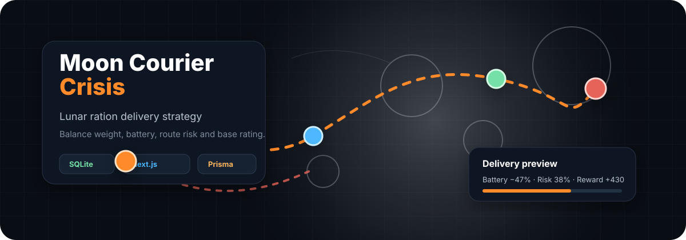
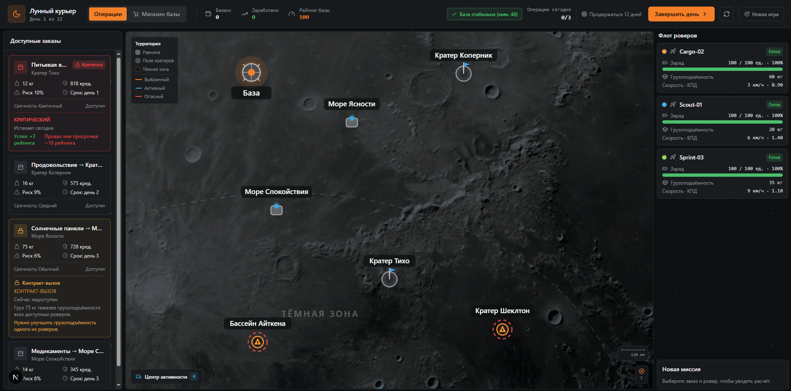
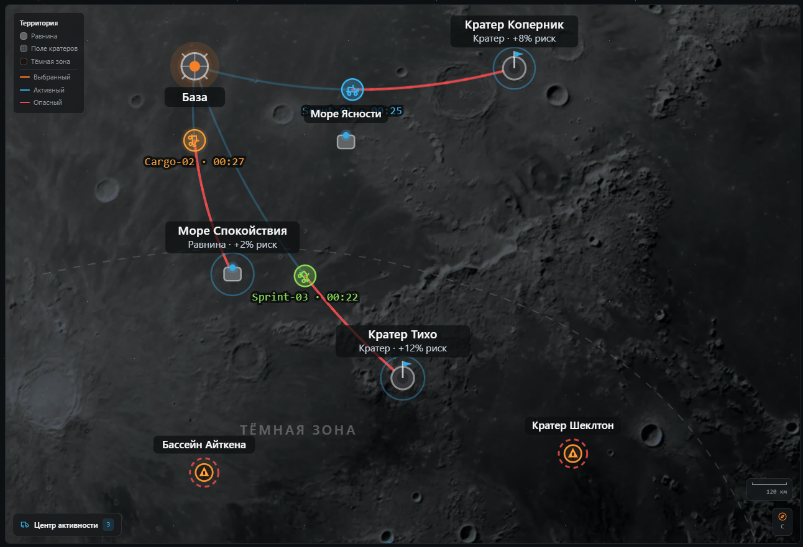
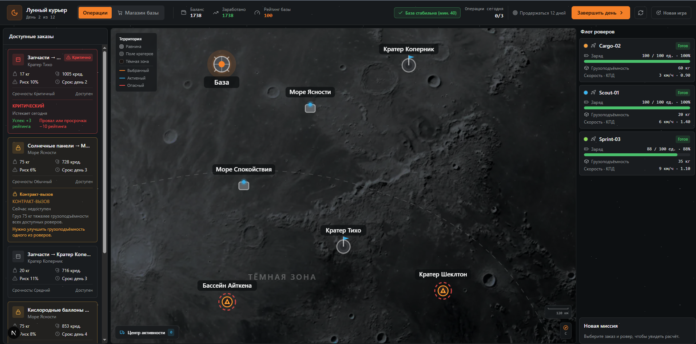
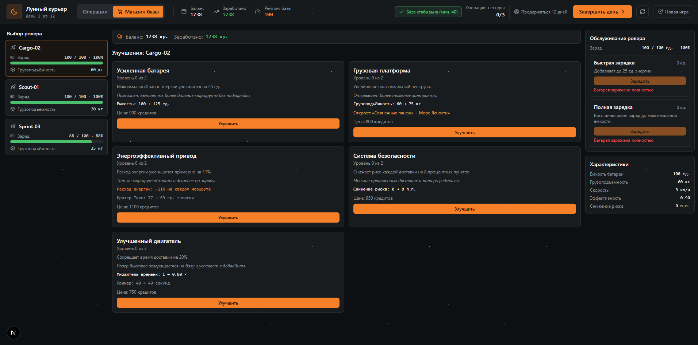
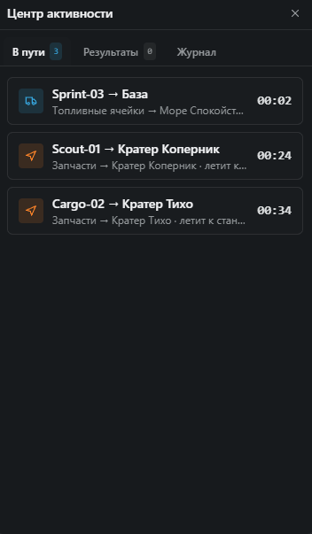
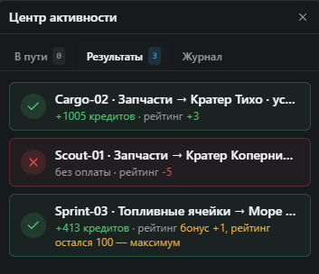
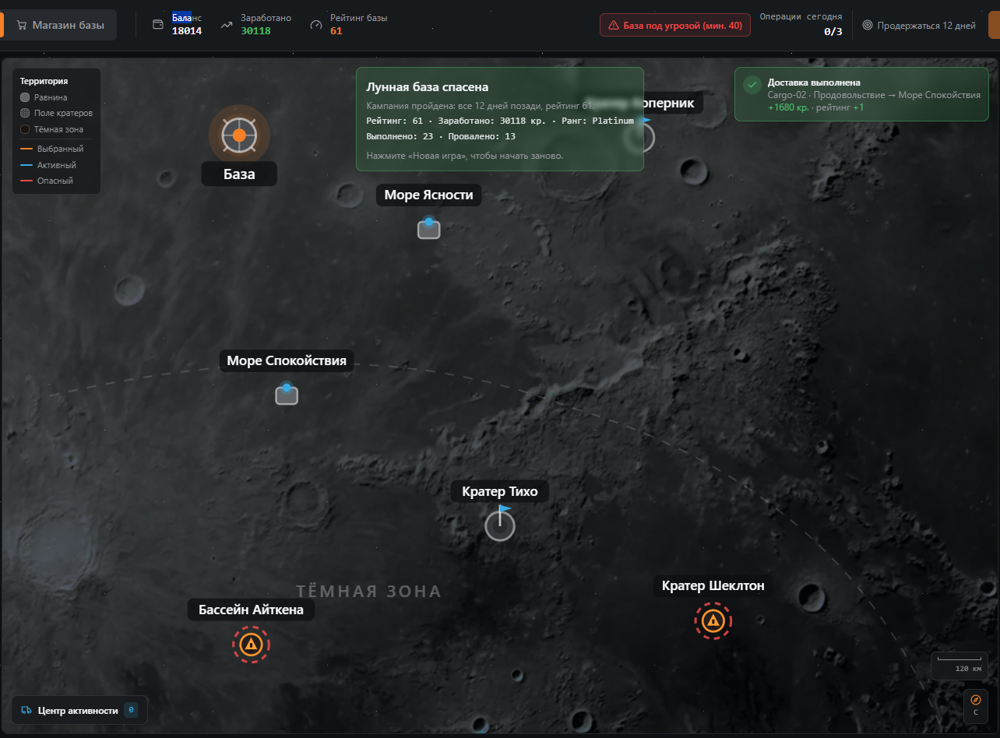
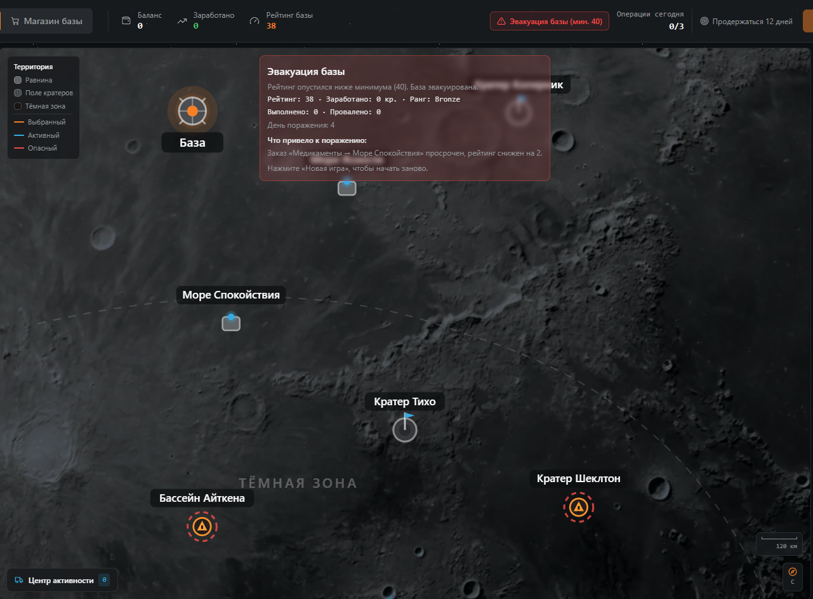

<p align="center">
  
</p>

<h1 align="center">Moon Courier Crisis</h1>

<p align="center">
  Маленький игровой симулятор лунной доставки: выбирайте заказ, назначайте ровер, считайте вес груза, батарею, риск маршрута и удерживайте рейтинг базы.
</p>

<p align="center">
  <a href="https://github.com/yatochkaa/Moon-Crisis"><strong>GitHub repository</strong></a>
  ·
  <a href="#-скриншоты">Screenshots</a>
  ·
  <a href="#-быстрый-запуск">Quick start</a>
  ·
  <a href="#-игровая-логика">Game rules</a>
</p>

<p align="center">
  
  
  
  
</p>

---

## О проекте

**Moon Courier Crisis** — это не форма заказа еды, а компактная стратегия про доставку пайков и грузов между лунной базой и опасными зонами карты. Игроку нужно заработать целевое количество кредитов за ограниченное число дней и не уронить рейтинг базы ниже минимума.

Игровой цикл простой:

1. Посмотреть карту Луны и активные точки заказов.
2. Выбрать заказ с весом, наградой, срочностью и риском.
3. Назначить подходящий ровер с нужной батареей и грузоподъёмностью.
4. Запустить доставку и получить результат: успех, провал или блокировка запуска.
5. Завершить день, получить новые последствия по дедлайнам и рейтингу.

---

## Что сделано по ТЗ

| Требование | Реализация |
| --- | --- |
| Экран с картой Луны или имитацией | Есть основной экран с лунной картой, базой, зонами и маршрутами. |
| Точки заказов на карте | Заказы отображаются как точки на карте и связаны с локациями. |
| Заказы с весом, наградой, срочностью и риском | У каждого заказа есть `weight`, `reward`, `deadlineDay`, `baseRisk` и локация. |
| Роверы с батареей, грузоподъёмностью и статусом | Роверы имеют `battery`, `capacity`, `status`, скорость и эффективность. |
| Выбор заказа и ровера | Игрок выбирает пару «заказ + ровер» и видит preview доставки. |
| Запуск доставки | Сервер пересчитывает расход батареи, риск, результат и обновляет состояние игры. |
| Хранение данных | Данные лежат в SQLite через Prisma: сессия, роверы, заказы, доставки, события. |
| Невозможная доставка | Есть сценарии с перегрузом, нехваткой батареи, занятым ровером или истёкшим дедлайном. |
| Цель игры | Набрать целевые кредиты, прожить несколько дней и не потерять рейтинг базы. |

---

## Скриншоты

| Карта и заказы | Работа роверов |
| --- | --- |
|  |  |

| День 2 | Магазин |
| --- | --- |
|  |  |

| Центр активности | Результаты доставок |
| --- | --- |
|  |  |

| Победа | Поражение |
| --- | --- |
|  |  |

---

## Быстрый запуск

### Требования

- Node.js 20 LTS или новее.
- pnpm 9 или новее.
- Интернет для первой установки зависимостей.

### Установка

```bash
git clone https://github.com/yatochkaa/Moon-Crisis.git
cd Moon-Crisis
pnpm install
cp .env.example .env
```

Пример локального `.env`:

```env
DATABASE_URL="file:./dev.db"
ALLOW_GAME_RESET="false"
```

### Подготовка базы

```bash
pnpm db:setup
```

Команда выполняет генерацию Prisma Client, применяет миграции и запускает seed с начальными данными.

### Запуск игры

```bash
pnpm dev
```

Откройте в браузере:

```text
http://localhost:3000
```

Для локальной отладки можно включить сброс игровой сессии:

```bash
ALLOW_GAME_RESET=true pnpm dev
```

---

## Проверки и тесты

```bash
pnpm typecheck     # проверка TypeScript
pnpm lint          # ESLint
pnpm test          # unit + integration тесты
pnpm build         # production-сборка
pnpm e2e           # Playwright, нужен ALLOW_GAME_RESET=true
```

Тестами покрыта критичная игровая логика: вес, батарея, риск, дедлайны, невозможные доставки, начисление награды, списание батареи, победа, поражение и идемпотентность запуска доставки.

---

## Игровая логика

### Основные параметры

| Сущность | Важные поля | Зачем нужны |
| --- | --- | --- |
| Заказ | вес, награда, дедлайн, базовый риск, локация | Определяет ценность и сложность доставки. |
| Ровер | батарея, грузоподъёмность, скорость, эффективность, статус | Ограничивает доступные маршруты и влияет на расход. |
| Локация | расстояние, зона риска, модификатор скорости, модификатор батареи | Делает разные участки карты неравными. |
| Доставка | заказ, ровер, итоговый риск, расход батареи, результат | Фиксирует попытку доставки. |
| Событие | тип, день, текст, метаданные | Заполняет журнал активности игрока. |

### Формулы

```text
baseDistanceCost = distance * location.batteryModifier
cargoCost        = order.weight * 0.25
batteryCost      = ceil((baseDistanceCost + cargoCost) / rover.efficiency)

duration         = ceil(distance / (rover.speed * location.speedModifier))

loadRatio        = order.weight / rover.capacity
risk             = clamp(round(order.baseRisk + location.riskBonus + loadRatio * 10), 0, 90)
```

### Как вес влияет на доставку

Тяжёлый груз влияет сразу на две вещи:

- увеличивает расход батареи через `cargoCost`;
- повышает риск маршрута через `loadRatio`.

Поэтому лёгкий заказ может быть безопасным для быстрого ровера, а тяжёлый груз потребует грузовой модели с большей грузоподъёмностью и запасом батареи.

### Когда доставка невозможна

Запуск блокируется, если:

- заказ уже выполнен, провален или просрочен;
- ровер не найден или сейчас не `idle`;
- вес заказа больше грузоподъёмности ровера;
- расчётный расход батареи выше текущего заряда;
- дедлайн заказа уже прошёл;
- игровая сессия завершена победой или поражением.

В демо есть как минимум два понятных невозможных сценария: слишком тяжёлый заказ и маршрут, на который не хватает батареи.

### Что меняется после доставки

После запуска сервер обновляет состояние игры:

- у ровера уменьшается батарея;
- заказ получает новый статус;
- успешная доставка добавляет кредиты;
- неудачная доставка может ухудшить рейтинг;
- в журнал событий добавляется запись;
- доставка сохраняется в базе с итоговыми числами.

Клиент не присылает награду, риск или расход батареи — все важные значения пересчитываются на сервере.

---

## Данные и хранение

Проект использует **SQLite** через **Prisma ORM**. Путь к базе задаётся переменной `DATABASE_URL`.

Основные модели:

```text
GameSession   # день, кредиты, рейтинг, состояние победы/поражения
Location      # точки карты, расстояние, риск, скорость, расход батареи
Rover         # батарея, грузоподъёмность, скорость, эффективность, статус
Order         # вес, награда, срочность, риск, статус, локация
Delivery      # история запусков и результатов
GameEvent     # журнал событий для интерфейса
```

Открыть базу в визуальном интерфейсе Prisma:

```bash
pnpm prisma studio
```

---

## Архитектура

```text
prisma/
  schema.prisma          # модели SQLite
  seed.ts                # начальные данные
src/
  domain/                # чистые правила игры без React и Prisma
  application/           # use cases, DTO, Zod-схемы, ошибки
  infrastructure/        # Prisma, репозитории, транзакции, random/id
  presentation/          # HTTP helpers и API-клиент
  components/            # UI игры
  app/                   # Next.js App Router и Route Handlers
  shared/                # общие тексты и утилиты
tests/
  unit/                  # быстрые тесты правил
  integration/           # сценарии application service
e2e/                     # Playwright-сценарии
docs/                    # правила, безопасность, AI usage
```

Такое разделение нужно, чтобы игровая логика была проверяемой и не зависела от интерфейса.

---

## API

| Метод | Путь | Назначение |
| --- | --- | --- |
| `GET` | `/api/game` | Получить состояние игры: сессия, карта, заказы, роверы, события. |
| `POST` | `/api/deliveries/preview` | Предварительно рассчитать доставку для выбранного заказа и ровера. |
| `POST` | `/api/deliveries` | Запустить доставку в транзакции. |
| `POST` | `/api/game/end-day` | Завершить игровой день. |
| `POST` | `/api/game/reset` | Сбросить локальную игру, если включён `ALLOW_GAME_RESET=true`. |

Пример ошибки:

```json
{
  "error": {
    "code": "INSUFFICIENT_BATTERY",
    "message": "Недостаточно заряда для этого маршрута",
    "details": {}
  }
}
```

---

## Безопасность и честность логики

- Все входные данные валидируются Zod-схемами.
- Клиент передаёт только `orderId`, `roverId` и `idempotencyKey`.
- Награда, риск, расход батареи и результат считаются на сервере.
- Запуск доставки выполняется внутри транзакции.
- `idempotencyKey` защищает от двойного начисления награды.
- Батарея не может уйти ниже нуля.
- Риск ограничен диапазоном `0–90`.
- Reset-эндпоинт выключен по умолчанию и предназначен только для локального тестирования.

---

## Использование AI

AI использовался как помощник при подготовке проекта и документации:

- структурирование README под требования тестового задания;
- оформление GitHub-страницы по принципам `beautify-github-readme`: проектный hero, доказательства из реального интерфейса, читаемый Markdown вместо одной большой картинки;
- генерация и вычитка описаний логики, запуска, хранения данных и ограничений;
- подготовка англоязычных имён файлов для скриншотов.

Критичная игровая логика не должна приниматься «на веру»: она вынесена в domain/application слой и проверяется тестами.

---

## Скриншоты в репозитории

Файлы скриншотов переименованы на английский язык и лежат в папке `screenshots/`:

```text
screenshots/main-screen.png
screenshots/day-2.png
screenshots/shop.png
screenshots/rover-operations.png
screenshots/activity-center-queue.png
screenshots/activity-center-results.png
screenshots/victory.png
screenshots/defeat.png
```

---

## Планы развития

- Анимация движения роверов по маршрутам.
- Апгрейды роверов и полноценный магазин улучшений.
- Случайные события: пылевые бури, сбои связи, повреждения груза.
- Многодневные доставки, ремонт и занятость роверов на несколько ходов.
- Переход на PostgreSQL для конкурентных сценариев.
- Авторизация и несколько сохранений на пользователя.

---

## Лицензия

MIT License. См. файл [`LICENSE`](LICENSE).
